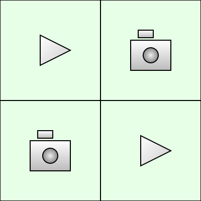

<table>
  <tr>
    <td></td>
    <td><h1>Display and Videowall App</h1></td>
  </tr>
</table>

This is a simple javascript app that will produce a webpage running slideshows with mixed content (videos and images).  Just drop this onto your webserver and it will work.  The **json/** folder is a **JSON Generator** that will create the json file for your slide automatically. **slides/** contains a demo slide of each layout type.

**[DEMO](https://imagelessthought.github.io/developr/videowall/)** Press **F11** for *full-screen mode* to see the slides as they would appear on a dedicated display.

## Features:
- Base aspect ratio (display): **16:9**.
- Suggested resolutions for displays and images: **1920x1080 (1080P)**, **3840x2160 (4K)** and **7680x4320 (8K)**. 
- Various layouts available, up to sixteen (16) independent elements can be shown at a time layout (see below).
- Each slide is a **json** file.
- An **index** file is used to specify the order of the slides.
- Each **slide** is an idependent slide show, the index can include slides with different layouts.
- You can set a **start time** (**12:00:00 PM**: it will start daily at the time specified), or **start date and time** (**2025-04-01 12:00:00**: it will start only on the date and time specified) in the slide **json**. In the index file just add an underscore before the slide name to enable the schedule. Leave out the underscore and it will play during the normal slideshow rotation.  
- You can set a countdown to be displayed with an information slide for a **scheduled slide**. 
- You can add a **QR code**  into any corner of any element.
- You can add a **custom logo/image** into any corner of any element.
- You can add **text overalys** to any element.
- Each element in a slide does not have to remain **static**, it can change any number of times you specify.
- Each slide can use a separate folder for its conent (**contentChild**).

## Recently Added Feature:
**March 29th**
- You can now schedule a window of time that a slide is shown using **beginRotation** and **endRotation**.  If you only specify a time  (**12:00:00 PM**), these windows will be **daily**.  If you specify a date and time (**2025-04-01 12:00:00**), the window will occur on the specified date.
- You do not have to specify both a **beginRotation** and **endRotation**.  By only specifying a **beginRotation**, the slide will join the rotation at that time.  By only specifying an **endRotation**, the slide will leave the rotation at that time.
- **beginRotation** and **endRotation** are not yet included as options in the **JSON Generator**.  I will try to get to it in the next week or so.

## Aspect Ratios and Resolutions
As mentioned above the base aspect ratio is **16:9**.  Basically the base aspect ratio should match the aspect ratio of the native resolution of your display. **16:9** is common but not universal.  We set our displays to **1920x1080** (which is **16:9**) but this is only marginally meaningful, mostly due to handful of *CSS* settings in the **default.css** for positioning. If you set your displays to a resolution with an aspect ratio of **16:9** and you create your content with the dimensions **1920x1080** (which has an aspect ratio of **16:9**), everything will look great and fit on your videowall (or single display) perfectly *for most common use cases* when using this app.

Modern displays do offer higher resolutions with aspect ratios of **16:9**: **3840x2160 (4K)** and **7680x4320 (8K)** being common examples, but they are also considerably more expensive. Ultimately, I just suggest you create your content with the dimensions that match what you set your display(s) at and set your display(s) to resolution with a **16:9** aspect ratio.  If you have a large number of displays in your videowall, you may need to rethink the dimensions of the content you use in your elements - especially if you want the element to span across all displays.  

**Common resolutions for the 16:9 ratio:**  

| Width | Height | Name    |
|-------|--------|---------|
| 640   | 360    | nHD     |
| 854   | 480    | FWVGA   |
| 960   | 540    | qHD     |
| 1024  | 576    | WSVGA   |
| 1280  | 720    | HD      |
| 1366  | 768    | FWXGA   |
| 1600  | 900    | HD+     |
| 1920  | 1080   | Full HD |
| 2560  | 1440   | QHD     |
| 3200  | 1800   | QHD+    |
| 3840  | 2160   | 4K UHD  |
| 5120  | 2880   | 5K      |
| 7680  | 4320   | 8K UHD  |

The table above and more information can be found in the **[Wikipedia](https://en.wikipedia.org/wiki/16:9_aspect_ratio)** article on the  **16:9** aspect ratio.  

For the layout examples below, I am assuming that you have four displays in a 2x2 grid.  

It is important to realize that if you do have four disiplays in a 2x2 grid, an element that spans all four will have an *effective* resolution of **3840x2160**. So if the content of your element is **1920x1080** it will be stretched to **3840x2106**. If you place four elements in a grid on a single display with **1920x1080** resolution, the effective resolution of each element wiļl be **960x540**, meaning each will be *reduced* in size when displayed. In both cases though the content will fit perfectly on the display (no cropping, or black bars) and you are not likely to observe any significant distortions *unless your content has small text and/or has a high degree of complexity*.  If you encounter distortion, you will want to create your content in the *effective* resolution shown in the layouts.

The exception to this is of course the **rows** and **columns** layouts.  You will want to review the **[Layouts](#layouts)** section below in regards to those.  You won't want to stretch a image or video with a **16:9** aspect ratio across a column or row, *in those cases use the effective resolutions* for your content.  You could just avoid those layouts or set a solid color background and use the **overlay text** feature when using them. 

### Why create your content in **1920x1080**
- it is easy to find free content at **1920x1080** and you want to update your content frequently or people will ignore your displays.
- most displays support **1920x1080**.

But whatever: the content is the kingmaker for this decision.

## Layouts:
The values in the layouts below are the *effective* resolutions assuming four displays in a 2x2 grid.  

**Full Screen/Videowall**
<pre style="padding:0; margin: 1rem 0; line-height: 1;">
    ┌─────────────────────────────────┐
    │                                 │
    │                                 │
    │                                 │
    │           <b>3840 x 2160</b>           │
    │             <b>(16:9)</b>              │
    │                                 │
    │                                 │
    │                                 │
    │                                 │
    └─────────────────────────────────┘
</pre>

**2x2 Grid**
<pre style="padding:0; margin: 0; line-height:1;">
    ┌────────────────┬────────────────┐
    │                │                │
    │   <b>1920 x 1080</b>  │                │
    │     <b>(16:9)</b>     │                │
    │                │                │
    ├────────────────┼────────────────┤   
    │                │                │
    │                │                │
    │                │                │
    │                │                │
    └────────────────┴────────────────┘
</pre>

**4x4 Grid (with or without padding around the elements)** 
<pre style="padding:0; margin: 1rem 0; line-height: 1;">
    ┌────────────────┬────────────────┬────────────────┬────────────────┐
    │                │                │                │                │
    │    <b>960 x 540</b>   │                │                │                │
    │     <b>(16:9)</b>     │                │                │                │
    │                │                │                │                │
    ├────────────────┼────────────────┼────────────────┼────────────────┤
    │                │                │                │                │
    │                │                │                │                │
    │                │                │                │                │
    │                │                │                │                │
    ├────────────────┼────────────────┼────────────────┼────────────────┤
    │                │                │                │                │
    │                │                │                │                │
    │                │                │                │                │
    │                │                │                │                │
    ├────────────────┼────────────────┼────────────────┼────────────────┤
    │                │                │                │                │
    │                │                │                │                │
    │                │                │                │                │
    │                │                │                │                │
    └────────────────┴────────────────┴────────────────┴────────────────┘
</pre>

**Two Columns**
<pre style="padding:0; margin: 1rem 0; line-height: 1;">
    ┌────────────────┬────────────────┐
    │                │                │
    │                │                │
    │                │                │
    │   <b>1920 x 2160</b>  │                │
    │      <b>(8:9)</b>     │                │  
    │                │                │
    │                │                │
    │                │                │
    │                │                │
    └────────────────┴────────────────┘
</pre>

**Column Left**
<pre style="padding:0; margin: 1rem 0; line-height: 1;">
    ┌────────────────┬────────────────┐
    │                │                │
    │                │   <b>1920 x 1080</b>  │
    │                │     <b>(16:9)</b>     │
    │   <b>1920 x 2160</b>  │                │   
    │      <b>(8:9)</b>     ├────────────────┤  
    │                │                │
    │                │                │
    │                │                │
    │                │                │
    └────────────────┴────────────────┘
</pre>

**Column Right**
<pre style="padding:0; margin: 1rem 0; line-height: 1;">
    ┌────────────────┬────────────────┐
    │                │                │
    │   <b>1920 x 1080</b>  │                │
    │     <b>(16:9)</b>     │                │
    │                │    <b>1920 x 2160</b> │   
    ├────────────────┤      <b>(8:9)</b>     │
    │                │                │
    │                │                │
    │                │                │
    │                │                │
    └────────────────┴────────────────┘
</pre>

**Rows**
<pre style="padding:0; margin: 1rem 0; line-height: 1;">
    ┌─────────────────────────────────┐
    │                                 │
    │          <b>3840 x 1080</b>            │
    │             <b>(32:9)</b>              │
    │                                 │
    ├─────────────────────────────────┤   
    │                                 │
    │                                 │
    │                                 │
    │                                 │
    └─────────────────────────────────┘
</pre>

**Row Top**
<pre style="padding:0; margin: 1rem 0; line-height: 1;">
    ┌─────────────────────────────────┐
    │                                 │
    │          <b>3840 x 1080</b>            │
    │             <b>(32:9)</b>              │
    │                                 │
    ├────────────────┬────────────────┤   
    │                │                │
    │   <b>1920 x 1080</b>  │                │
    │     <b>(16:9)</b>     │                │      
    │                │                │
    └────────────────┴────────────────┘
</pre>

**Row Bottom**
<pre style="padding:0; margin: 1rem 0; line-height: 1;">
    ┌────────────────┬────────────────┐
    │                │                │
    │   <b>1920 x 1080</b>  │                │
    │     <b>(16:9)</b>     │                │      
    │                │                │
    ├────────────────┴────────────────┤
    │                                 │
    │          <b>3840 x 1080</b>            │
    │             <b>(32:9)</b>              │
    │                                 │
    └─────────────────────────────────┘
</pre>
